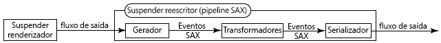

# Utilização do Dispatcher com vários domínios {#using-dispatcher-with-multiple-domains}

>[!NOTE]
>
>As versões do Dispatcher são independentes do AEM. Você pode ter sido redirecionado para esta página se tiver seguido um link para a documentação do Dispatcher incorporada à documentação do AEM ou do CQ.

Use o Dispatcher para processar solicitações de página em vários domínios da Web, enquanto oferece suporte às seguintes condições:

* O conteúdo da Web para ambos os domínios é armazenado em um único repositório do AEM.
* Os arquivos no cache do Dispatcher podem ser invalidados separadamente para cada domínio.

Por exemplo, uma empresa publica sites para duas de suas marcas: marca A e marca B. O conteúdo das páginas dos sites é criado no AEM e armazenado no mesmo espaço de trabalho do repositório:

```
/
| - content  
   | - sitea  
       | - content nodes  
   | - siteb  
       | - content nodes
```

As páginas para a `BrandA.com` são armazenadas abaixo de `/content/sitea`. As solicitações do cliente para o URL `https://BrandA.com/en.html` são retornadas à página renderizada para o nó `/content/sitea/en`. Da mesma forma, as páginas para a `BrandB.com` são armazenadas abaixo de `/content/siteb`.

Ao usar o Dispatcher para armazenar o conteúdo em cache, devem ser feitas associações entre o URL da página na solicitação HTTP do cliente, o caminho do arquivo correspondente no cache e o caminho do arquivo correspondente no repositório.

## Solicitações do cliente

Quando os clientes enviam solicitações HTTP para o servidor Web, o URL da página solicitada deve ser resolvido para o conteúdo no cache do Dispatcher e, por fim, para o conteúdo no repositório.


1. O sistema de nome de domínio descobre o endereço IP do servidor Web que está registrado para o nome de domínio na solicitação HTTP.
1. A solicitação HTTP é enviada para o servidor Web.
1. A solicitação HTTP é transmitida para o Dispatcher.
1. O Dispatcher determina se os arquivos em cache são válidos. Se forem válidos, eles serão enviados ao cliente.
1. Se os arquivos em cache não forem válidos, o Dispatcher solicitará páginas recém-renderizadas da instância de publicação do AEM.

## Invalidação de cache

Quando os agentes de replicação de limpeza solicitam que o Dispatcher invalide os arquivos em cache, o caminho do conteúdo no repositório deve resolver para o conteúdo no cache.


1. Uma página é ativada na instância do autor do AEM e o conteúdo é replicado para a instância de publicação.
1. O agente de limpeza chama o Dispatcher para invalidar o cache do conteúdo replicado.
1. O Dispatcher toca em um ou mais arquivos .stat para invalidar os arquivos em cache.

Para usar o Dispatcher com vários domínios, você precisa configurar o AEM, o Dispatcher e o servidor Web. Esta página descreve soluções gerais que se aplicam à maioria dos ambientes. Devido à complexidade de algumas topologias do AEM, sua solução pode exigir mais configurações personalizadas para resolver problemas específicos. É provável que você precise adaptar os exemplos para atender às políticas existentes de infraestrutura e gerenciamento de TI.

## Mapeamento de URL {#url-mapping}

Para permitir que URLs de domínio e caminhos de conteúdo sejam resolvidos em arquivos em cache, em algum momento do processo um caminho de arquivo ou URL de página deve ser traduzido. São fornecidas descrições das seguintes estratégias comuns, em que as traduções de caminho ou URL ocorrem em diferentes pontos do processo:

* (Recomendado) A instância de publicação do AEM usa o mapeamento Sling na resolução de recursos para implementar regras internas de reescrita de URL. Os URLs de domínio são traduzidos para caminhos do repositório de conteúdo. Consulte [AEM substitui URLs de entrada](#aem-rewrites-incoming-urls).
* O servidor da Web usa regras internas de reescrita de URL que traduzem URLs de domínio para caminhos de cache. Consulte [O servidor Web reescreve URLs de entrada](#the-web-server-rewrites-incoming-urls).

No geral, é desejável usar URLs curtos para páginas da Web. Normalmente, os URLs de página espelham a estrutura das pastas do repositório que contêm o conteúdo da Web. No entanto, os URLs não revelam os nós de repositório mais importantes, como `/content`. O cliente não está necessariamente ciente da estrutura do repositório do AEM.

## Requisitos gerais {#general-requirements}

Seu ambiente deve implementar as seguintes configurações para dar suporte ao Dispatcher que trabalha com vários domínios:

* O conteúdo de cada domínio reside em ramificações separadas do repositório (consulte o ambiente de exemplo abaixo).
* O agente de replicação de limpeza do Dispatcher é configurado na instância de publicação do AEM. (Consulte [Invalidação do cache do Dispatcher de uma instância de publicação](page-invalidate.md).)
* O sistema de nomes de domínio resolve os nomes de domínio para o endereço IP do servidor Web.
* O cache do Dispatcher espelha a estrutura de diretório do repositório de conteúdo do AEM. Os caminhos de arquivo abaixo da raiz do documento do servidor Web são os mesmos caminhos dos arquivos no repositório.

## Ambiente para os exemplos fornecidos {#environment-for-the-provided-examples}

As soluções de exemplo fornecidas se aplicam a um ambiente com as seguintes características:

* As instâncias do autor e de publicação do AEM são implantadas em sistemas Linux.
* O Apache HTTPD é o servidor Web, implantado em um sistema Linux.
* O repositório de conteúdo do AEM e a raiz do documento do servidor Web usam as seguintes estruturas de arquivo (a raiz do documento do Apache Web Server é /`usr/lib/apache/httpd-2.4.3/htdocs)`:

   **Repositório**

```
  | - /content  
    | - sitea  
  |    | - content nodes 
    | - siteb  
       | - conent nodes
```

**Raiz do documento do servidor Web**

```
  | - /usr  
    | - lib  
      | - apache  
        | - httpd-2.4.3  
          | - htdocs  
            | - content  
              | - sitea  
                 | - content nodes 
              | - siteb  
                 | - content nodes
```

## O AEM reescreve URLs de entrada {#aem-rewrites-incoming-urls}

O mapeamento Sling para resolução de recursos permite associar URLs recebidos a caminhos de conteúdo do AEM. Crie mapeamentos na instância de publicação do AEM para que as solicitações de renderização do Dispatcher resolvam para o conteúdo correto no repositório.

As solicitações do Dispatcher para renderização de página identificam a página usando o URL transmitido pelo servidor Web. Quando o URL inclui um nome de domínio, os mapeamentos Sling resolvem o URL para o conteúdo. O gráfico a seguir ilustra um mapeamento do URL `branda.com/en.html` para o nó `/content/sitea/en`.


O cache do Dispatcher espelha a estrutura do nó do repositório. Portanto, mediante ativações de página, as solicitações resultantes para invalidar a página em cache não exigem URL ou traduções de caminho.


## Definição de hosts virtuais no servidor Web {#define-virtual-hosts-on-the-web-server}

Defina hosts virtuais no servidor Web para que uma raiz de documento diferente possa ser atribuída a cada domínio da Web:

* O servidor Web deve definir um domínio virtual para cada um dos domínios da Web.
* Para cada domínio, configure a raiz do documento para coincidir com a pasta no repositório que possui o conteúdo da Web do domínio.
* Cada domínio virtual também deve incluir configurações relacionadas ao Dispatcher, conforme descrito na página [Instalação do Dispatcher](dispatcher-install.md).

O arquivo de exemplo `httpd.conf` a seguir configura dois domínios virtuais para um servidor Web Apache:

* Os nomes de servidor (que coincidem com os nomes de domínio) são branda.com (linha 16) e brandb.com (linha 30).
* A raiz do documento de cada domínio virtual é o diretório no cache do Dispatcher que contém as páginas do site. (linhas 17 e 31)

Com essa configuração, o servidor Web executa as seguintes ações quando recebe uma solicitação para `https://branda.com/en/products.html`:

* Associa o URL ao host virtual que tem um `ServerName` de `branda.com.`

* Encaminha o URL para o Dispatcher.

### httpd.conf {#httpd-conf}

```xml
# load the Dispatcher module
LoadModule dispatcher_module modules/mod_dispatcher.so
# configure the Dispatcher module
<IfModule disp_apache2.c>
 DispatcherConfig conf/dispatcher.any
 DispatcherLog    logs/dispatcher.log  
 DispatcherLogLevel 3
 DispatcherNoServerHeader 0 
 DispatcherDeclineRoot 0
 DispatcherUseProcessedURL 0
 DispatcherPassError 0
</IfModule>

# Define virtual host for brandA.com
<VirtualHost *:80>
  ServerName branda.com
  DocumentRoot /usr/lib/apache/httpd-2.4.3/htdocs/content/sitea
   <Directory /usr/lib/apache/httpd-2.4.3/htdocs/content/sitea>
     <IfModule disp_apache2.c>
       SetHandler dispatcher-handler
       ModMimeUsePathInfo On
     </IfModule>
     Options FollowSymLinks
     AllowOverride None
   </Directory>
</VirtualHost>

# define virtual host for brandB.com
<VirtualHost *:80>
  ServerName brandB.com
  DocumentRoot /usr/lib/apache/httpd-2.4.3/htdocs/content/siteb
   <Directory /usr/lib/apache/httpd-2.4.3/htdocs/content/siteb>
     <IfModule disp_apache2.c>
       SetHandler dispatcher-handler
       ModMimeUsePathInfo On
     </IfModule>
     Options FollowSymLinks
     AllowOverride None
   </Directory>
</VirtualHost>

# document root for web server
DocumentRoot "/usr/lib/apache/httpd-2.4.3/htdocs"
```

Observe que os hosts virtuais herdam o valor da propriedade [DispatcherConfig](dispatcher-install.md#main-pars-67-table-7) que está configurada na seção do servidor principal. Os hosts virtuais podem incluir sua própria propriedade DispatcherConfig para substituir a configuração do servidor principal.

### Configuração do Dispatcher para lidar com vários domínios {#configure-dispatcher-to-handle-multiple-domains}

Para oferecer suporte a URLs que incluem nomes de domínio e seus hosts virtuais correspondentes, defina os seguintes farms do Dispatcher:

* Configure um farm do Dispatcher para cada host virtual. Esses farms processam solicitações do servidor Web para cada domínio, verificam arquivos em cache e solicitam páginas dos renderizadores.
* Configure um farm do Dispatcher usado para invalidar o conteúdo do cache, independentemente do domínio ao qual o conteúdo pertence. Esse farm lida com solicitações de invalidação de arquivos dos agentes de replicação de limpeza do Dispatcher.

### Criação de farms do Dispatcher para hosts virtuais

Os farms para hosts virtuais devem ter as seguintes configurações para que os URLs nas solicitações HTTP do cliente sejam resolvidos para os arquivos corretos no cache do Dispatcher:

* A propriedade `/virtualhosts` é definida como o nome de domínio. Essa propriedade permite que o Dispatcher associe o farm ao domínio.
* A propriedade `/filter` permite acesso ao caminho do URL da solicitação truncado após a parte do nome de domínio. Por exemplo, para o URL `https://branda.com/en.html`, o caminho é interpretado como `/en.html`, portanto, o filtro deve permitir acesso a esse caminho.

* A propriedade `/docroot` é definida como o caminho do diretório raiz do conteúdo do site do domínio no cache do Dispatcher. Esse caminho é usado como o prefixo do URL concatenado da solicitação original. Por exemplo, o docroot de `/usr/lib/apache/httpd-2.4.3/htdocs/sitea` faz com que a solicitação de `https://branda.com/en.html` resolva para o arquivo `/usr/lib/apache/httpd-2.4.3/htdocs/sitea/en.html`.

Além disso, a instância de publicação do AEM deve ser designada como renderização para o host virtual. Configure outras propriedades do farm, conforme necessário. O código a seguir é uma configuração de farm abreviada para o domínio branda.com:

```xml
/farm_sitea  {     
    ...
    /virtualhosts { "branda.com" }
    /renders {
      /rend01  { /hostname "127.0.0.1"  /port "4503" }
    }
    /filter {
      /0001 { /type "deny"  /glob "*" }
      /0023 { /type "allow" /glob "*/en*" }  
      ...
     }
    /cache {
      /docroot "/usr/lib/apache/httpd-2.4.3/htdocs/content/sitea"
      ...
   }
   ...
}
```

### Criar um farm do Dispatcher para invalidação de cache

Um farm do Dispatcher é necessário para manipular solicitações para invalidar arquivos em cache. Esse farm deve ser capaz de acessar arquivos .stat nos diretórios docroot de cada host virtual.

As seguintes configurações de propriedade permitem que o Dispatcher resolva arquivos no repositório de conteúdo do AEM a partir de arquivos no cache:

* A propriedade `/docroot` é definida como docroot padrão do servidor Web. Normalmente, esse é o diretório onde a pasta `/content` é criada. Um exemplo de valor para o Apache no Linux é `/usr/lib/apache/httpd-2.4.3/htdocs`.
* A propriedade `/filter` permite acesso a arquivos abaixo do diretório `/content`.

A propriedade `/statfileslevel`deve ser alta o suficiente para que os arquivos .stat sejam criados no diretório raiz de cada host virtual. Essa propriedade permite que o cache de cada domínio seja invalidado separadamente. Para a configuração do exemplo, um valor `/statfileslevel` de `2` cria arquivos .stat no diretório `*docroot*/content/sitea` e no diretório `*docroot*/content/siteb`.

Além disso, a instância de publicação deve ser designada como renderização para o host virtual. Configure outras propriedades do farm, conforme necessário. O código a seguir é uma configuração abreviada para o farm usado para invalidar o cache:

```xml
/farm_flush {  
    ...
    /virtualhosts   { "invalidation_only" }
    /renders  {
      /rend01  { /hostname "127.0.0.1" /port "4503" }
    }
    /filter   {
      /0001 { /type "deny"  /glob "*" }
      /0023 { /type "allow" /glob "*/content*" } 
      ...
      }
    /cache  {
       /docroot "/usr/lib/apache/httpd-2.4.3/htdocs"
       /statfileslevel "2"
       ...
   }
   ...
}
```

Ao iniciar o servidor Web, o log do Dispatcher (no modo de depuração) indica a inicialização de todos os farms:

```shell
Dispatcher initializing (build 4.1.2)
[Fri Nov 02 16:27:18 2012] [D] [24974(140006182991616)] farms[farm_sitea].cache.docroot = /usr/lib/apache/httpd-2.4.3/htdocs/content/sitea
[Fri Nov 02 16:27:18 2012] [D] [24974(140006182991616)] farms[farm_siteb].cache.docroot = /usr/lib/apache/httpd-2.4.3/htdocs/content/siteb
[Fri Nov 02 16:27:18 2012] [D] [24974(140006182991616)] farms[farm_flush].cache.docroot = /usr/lib/apache/httpd-2.4.3/htdocs
[Fri Nov 02 16:27:18 2012] [I] [24974(140006182991616)] Dispatcher initialized (build 4.1.2)
```

### Configuração do mapeamento Sling para resolução de recursos {#configure-sling-mapping-for-resource-resolution}

Use o mapeamento Sling para resolução de recursos, de modo que os URLs baseados em domínio resolvam para o conteúdo na instância de publicação do AEM. O mapeamento de recursos traduz os URLs recebidos do Dispatcher (originalmente de solicitações HTTP do cliente) para nós de conteúdo.

Para saber mais sobre o mapeamento de recursos Sling, consulte [Mapeamentos para resolução de recursos](https://sling.apache.org/site/mappings-for-resource-resolution.html), na documentação do Sling.

Normalmente, os mapeamentos são necessários para os seguintes recursos, embora possam ser necessários mapeamentos adicionais:

* O nó raiz da página de conteúdo (abaixo de `/content`)
* O nó de design que as páginas usam (abaixo de `/etc/designs`)
* A pasta `/libs`

Depois de criar o mapeamento para a página de conteúdo, para descobrir os mapeamentos necessários adicionais, use um navegador da Web para abrir uma página no servidor Web. No arquivo error.log da instância de publicação, localize mensagens sobre recursos que não foram encontrados. A seguinte mensagem de exemplo indica que é necessário um mapeamento para `/etc/clientlibs`:

```shell
01.11.2012 15:59:24.601 *INFO* [10.36.34.243 [1351799964599] GET /etc/clientlibs/foundation/jquery.js HTTP/1.1] org.apache.sling.engine.impl.SlingRequestProcessorImpl service: Resource /content/sitea/etc/clientlibs/foundation/jquery.js not found
```

>[!NOTE]
>
>O transformador do linkchecker da reescrita padrão do Apache Sling modifica automaticamente os hiperlinks na página para evitar links desfeitos. No entanto, a reescrita de links é executada somente quando o destino do link é um arquivo HTML ou HTM. Para atualizar links para outros tipos de arquivo, crie um componente de transformador e adicione-o a um pipeline de reescrita HTML.

### Exemplo de nós de mapeamento de recursos

A tabela a seguir lista os nós que implementam o mapeamento de recursos para o domínio branda.com. Os nós semelhantes são criados para o domínio `brandb.com`, como `/etc/map/http/brandb.com`. Em todos os casos, os mapeamentos são necessários quando as referências no HTML da página não são resolvidas corretamente no contexto do Sling.

| Caminho do nó | Tipo | Propriedade |
|--- |--- |--- |
| `/etc/map/http/branda.com` | sling:Mapping | Nome: sling:internalRedirect Tipo: Cadeia de caracteres Valor: /content/sitea |
| `/etc/map/http/branda.com/libs` | sling:Mapping | Nome: sling:internalRedirect <br/>Tipo: Cadeia de caracteres <br/>Valor: /libs |
| `/etc/map/http/branda.com/etc` | sling:Mapping |  |
| `/etc/map/http/branda.com/etc/designs` | sling:Mapping | Nome: sling:internalRedirect <br/>VType: Cadeia de caracteres <br/>VValue: /etc/designs |
| `/etc/map/http/branda.com/etc/clientlibs` | sling:Mapping | Nome: sling:internalRedirect <br/>VType: Cadeia de caracteres <br/>VValue: /etc/clientlibs |

## Configuração do agente de replicação de limpeza do Dispatcher {#configuring-the-dispatcher-flush-replication-agent}

O agente de replicação de limpeza do Dispatcher na instância de publicação do AEM deve enviar solicitações de invalidação para o farm correto do Dispatcher. Para direcionar um farm, use a propriedade URI do agente de replicação de limpeza do Dispatcher (na guia Transporte). Inclua o valor da propriedade `/virtualhost` para o farm do Dispatcher configurado para invalidar o cache:

`https://*webserver_name*:*port*/*virtual_host*/dispatcher/invalidate.cache`

Por exemplo, para usar o farm `farm_flush` do exemplo anterior, o URI é `https://localhost:80/invalidation_only/dispatcher/invalidate.cache`.


## O servidor Web reescreve URLs de entrada {#the-web-server-rewrites-incoming-urls}

Use o recurso interno de reescrita de URL do seu servidor Web para traduzir URLs baseados em domínio para caminhos de arquivo no cache do Dispatcher. Por exemplo, as solicitações do cliente para a página `https://brandA.com/en.html` são traduzidas para o arquivo `content/sitea/en.html` na raiz do documento do servidor Web.


O cache do Dispatcher espelha a estrutura do nó do repositório. Portanto, mediante as ativações de página, as solicitações resultantes para invalidar a página em cache não exigem URL ou traduções de caminho.


## Definição de hosts virtuais e reescrita de regras no servidor Web {#define-virtual-hosts-and-rewrite-rules-on-the-web-server}

Configure os seguintes aspectos no servidor Web:

* Defina um host virtual para cada um dos domínios da Web.
* Para cada domínio, configure a raiz do documento para coincidir com a pasta no repositório que possui o conteúdo da Web do domínio.
* Para cada domínio virtual, crie uma regra de renomeação de URL que traduza o URL de entrada para o caminho do arquivo em cache.
* Cada domínio virtual também deve incluir configurações relacionadas ao Dispatcher, conforme descrito na página [Instalação do Dispatcher](dispatcher-install.md).
* O módulo Dispatcher deve ser configurado para usar o URL reescrito pelo servidor Web. (Consulte a propriedade `DispatcherUseProcessedURL` em [Instalação do Dispatcher](dispatcher-install.md).)

O seguinte exemplo de arquivo httpd.conf configura dois hosts virtuais para um servidor Web Apache:

* Os nomes de servidor (que coincidem com os nomes de domínio) são `brandA.com` (linha 16) e `brandB.com` (linha 32).

* A raiz do documento de cada domínio virtual é o diretório no cache do Dispatcher que contém as páginas do site. (linhas 20 e 33)
* A regra de reescrita de URL para cada domínio virtual é uma expressão regular que prefixa o caminho da página solicitada com o caminho para as páginas no cache. (linhas 19 e 35)
* A propriedade `DispatherUseProcessedURL` é definida como `1`. (linha 10)

Por exemplo, o servidor Web executa as seguintes ações quando recebe uma solicitação com o URL `https://brandA.com/en/products.html`:

* Associa o URL ao host virtual que tem um `ServerName` de `brandA.com.`
* Substitui o URL para ser `/content/sitea/en/products.html.`
* Encaminha o URL para o Dispatcher.

### httpd.conf {#httpd-conf-1}

```xml
# load the Dispatcher module
LoadModule dispatcher_module modules/mod_dispatcher.so
# configure the Dispatcher module
<IfModule disp_apache2.c>
 DispatcherConfig conf/dispatcher.any
 DispatcherLog    logs/dispatcher.log  
 DispatcherLogLevel 3
 DispatcherNoServerHeader 0 
 DispatcherDeclineRoot 0
 DispatcherUseProcessedURL 1
 DispatcherPassError 0
</IfModule>

# Define virtual host for brandA.com
<VirtualHost *:80>
  ServerName branda.com
  DocumentRoot /usr/lib/apache/httpd-2.4.3/htdocs/content/sitea
  RewriteEngine  on
  RewriteRule    ^/(.*)\.html$  /content/sitea/$1.html [PT]
   <Directory /usr/lib/apache/httpd-2.4.3/htdocs/content/sitea>
     <IfModule disp_apache2.c>
       SetHandler dispatcher-handler
       ModMimeUsePathInfo On
     </IfModule>
     Options FollowSymLinks
     AllowOverride None
   </Directory>
</VirtualHost>

# define virtual host for brandB.com
<VirtualHost *:80>
  ServerName brandB.com
  DocumentRoot /usr/lib/apache/httpd-2.4.3/htdocs/content/siteb
  RewriteEngine  on
  RewriteRule    ^/(.*)\.html$  /content/siteb/$1.html [PT]
   <Directory /usr/lib/apache/httpd-2.4.3/htdocs/content/siteb>
     <IfModule disp_apache2.c>
       SetHandler dispatcher-handler
       ModMimeUsePathInfo On
     </IfModule>
     Options FollowSymLinks
     AllowOverride None
   </Directory>
</VirtualHost>

# document root for web server
DocumentRoot "/usr/lib/apache/httpd-2.4.3/htdocs"
```

### Configuração de um farm do Dispatcher {#configure-a-dispatcher-farm}

Quando o servidor Web reescreve URLs, o Dispatcher requer um único farm definido de acordo com a [Configuração do Dispatcher](dispatcher-configuration.md). As seguintes configurações são necessárias para suportar hosts virtuais do servidor Web e regras de renomeação de URL:

* A propriedade `/virtualhosts` deve incluir os valores de ServerName para todas as definições de VirtualHost.
* A propriedade `/statfileslevel` deve ser alta o suficiente para criar arquivos .stat nos diretórios que contêm os arquivos de conteúdo para cada domínio.

O exemplo de arquivo de configuração a seguir é baseado no arquivo de exemplo `dispatcher.any` que está instalado com o Dispatcher. As seguintes alterações são necessárias para suportar as configurações do servidor Web do arquivo `httpd.conf` anterior:

* A propriedade `/virtualhosts` faz com que o Dispatcher manipule solicitações para os domínios `brandA.com` e `brandB.com`. (linha 12)
* A propriedade `/statfileslevel` é definida como 2, para que os arquivos .stat sejam criados em cada diretório que contenha o conteúdo da Web do domínio (linha 41): `/statfileslevel "2"`

Como de costume, a raiz do documento do cache é a mesma raiz do documento do servidor Web (linha 40): `/usr/lib/apache/httpd-2.4.3/htdocs`

### `dispatcher.any` {#dispatcher-any}

```xml
/name "testDispatcher"
/farms
  {
  /dispfarm0
    {  
    /clientheaders
      {
      "*"
      }      
    /virtualhosts
      {
      "brandA.com" "brandB.com"
      }
    /renders
      {
      /rend01    {  /hostname "127.0.0.1"   /port "4503"  }
      }
    /filter
      {
      /0001 { /type "deny"  /glob "*" }
      /0023 { /type "allow" /glob "*/content*" }  # disable this rule to allow mapped content only
      /0041 { /type "allow" /glob "* *.css *"   }  # enable css
      /0042 { /type "allow" /glob "* *.gif *"   }  # enable gifs
      /0043 { /type "allow" /glob "* *.ico *"   }  # enable icos
      /0044 { /type "allow" /glob "* *.js *"    }  # enable javascript
      /0045 { /type "allow" /glob "* *.png *"   }  # enable png
      /0046 { /type "allow" /glob "* *.swf *"   }  # enable flash
      /0061 { /type "allow" /glob "POST /content/[.]*.form.html" }  # allow POSTs to form selectors under content
      /0062 { /type "allow" /glob "* /libs/cq/personalization/*"  }  # enable personalization
      /0081 { /type "deny"  /glob "GET *.infinity.json*" }
      /0082 { /type "deny"  /glob "GET *.tidy.json*"     }
      /0083 { /type "deny"  /glob "GET *.sysview.xml*"   }
      /0084 { /type "deny"  /glob "GET *.docview.json*"  }
      /0085 { /type "deny"  /glob "GET *.docview.xml*"  }      
      /0086 { /type "deny"  /glob "GET *.*[0-9].json*" }
      /0090 { /type "deny"  /glob "* *.query.json*" }
      }
    /cache
      {
      /docroot "/usr/lib/apache/httpd-2.4.3/htdocs"
      /statfileslevel "2"
      /allowAuthorized "0"
      /rules
        {
        /0000  { /glob "*"     /type "allow"  }
        }
      /invalidate
        {
        /0000  {   /glob "*" /type "deny"  }
        /0001 {  /glob "*.html" /type "allow"  }
        }
      /allowedClients
        {
        }     
      }
    /statistics
      {
      /categories
        {
        /html  { /glob "*.html" }
        /others  {  /glob "*"  }
        }
      }
    }
  }
```

>[!NOTE]
>
>Como um único farm do Dispatcher é definido, o agente de replicação de limpeza do Dispatcher na instância de publicação do AEM não requer configurações especiais.

## Reescrita de links para arquivos que não são HTML {#rewriting-links-to-non-html-files}

Para reescrever referências a arquivos com extensões diferentes de .html ou .htm, crie um componente de transformador de reescrita do Sling e adicione-o ao pipeline de reescrita padrão.

Reescreva referências quando os caminhos de recursos não resolverem corretamente no contexto do servidor Web. Por exemplo, um transformador é necessário quando os componentes geradores de imagem criam links como /content/sitea/en/products.navimage.png. O componente de navegação superior de [Como criar um site completo](https://helpx.adobe.com/experience-manager/6-5/sites/developing/using/the-basics.html) cria esses links.

O [reescritor Sling](https://sling.apache.org/documentation/bundles/output-rewriting-pipelines-org-apache-sling-rewriter.html) é um módulo que pós-processa a saída do Sling. As implementações de pipeline SAX da reescrita consistem em um gerador, um ou mais transformadores e um serializador:

* **Gerador:** analisa o fluxo de saída do Sling (documento HTML) e gera eventos SAX quando encontra tipos de elemento específicos.
* **Transformador:** escuta a eventos SAX e, consequentemente, modifica o destino do evento (um elemento HTML). Um pipeline de reescrita contém zero ou mais transformadores. Os transformadores são executados em sequência, transmitindo os eventos SAX para o próximo transformador na sequência.
* **Serializador:** serializa a saída, incluindo as modificações de cada transformador.



### Pipeline de reescrita padrão do AEM {#the-aem-default-rewriter-pipeline}

O AEM usa uma reescrita de pipeline padrão que processa documentos do tipo text/html:

* O gerador analisa documentos HTML e gera eventos SAX ao encontrar elementos a, img, area, form, base, link, script e body. O alias do gerador é `htmlparser`.
* O pipeline inclui os seguintes transformadores: `linkchecker`, `mobile`, `mobiledebug`, `contentsync`. O transformador `linkchecker` externaliza caminhos para arquivos HTML ou HTM referenciados para evitar links desfeitos.
* O serializador escreve a saída HTML. O alias do serializador é htmlwriter.

O nó `/libs/cq/config/rewriter/default` define o pipeline.

### Criação de um transformador {#creating-a-transformer}

Execute as seguintes tarefas para criar um componente de transformador e usá-lo em um pipeline:

1. Implemente a interface `org.apache.sling.rewriter.TransformerFactory`. Essa classe cria instâncias de sua classe de transformador. Especifique valores para a propriedade `transformer.type` (o alias do transformador) e configure a classe como um componente de serviço OSGi.
1. Implemente a interface `org.apache.sling.rewriter.Transformer`. Para minimizar o trabalho, você pode estender a classe `org.apache.cocoon.xml.sax.AbstractSAXPipe`. Substitua o método startElement para personalizar o comportamento de reescrita. Esse método é chamado para cada evento SAX transmitido para o transformador.
1. Agrupar e implantar as classes.
1. Adicione um nó de configuração ao aplicativo do AEM para adicionar o transformador ao pipeline.

>[!TIP]
>Em vez disso, você pode configurar o TransformerFactory para que o transformador seja inserido em cada reescritor definido. Consequentemente, não é necessário configurar um pipeline:
>
>* Defina a propriedade `pipeline.mode` para `global`. 
>* Defina a propriedade `service.ranking` como um inteiro positivo.
>* Não inclua uma propriedade `pipeline.type`.


>[!NOTE]
>
>Use o arquétipo [multimódulo](https://helpx.adobe.com/br/experience-manager/aem-previous-versions.html) do Plug-in Maven do pacote de conteúdo para criar seu projeto Maven. Os POMs criam e instalam automaticamente um pacote de conteúdo.

Os exemplos a seguir implementam um transformador que reescreve referências a arquivos de imagem.

* A classe MyRewriterTransformerFactory instancia objetos MyRewriterTransformer. A propriedade pipeline.type define o alias do transformador como mytransformer. Para incluir o alias em um pipeline, o nó de configuração do pipeline inclui esse alias na lista de transformadores.
* A classe MyRewriterTransformer substitui o método startElement da classe AbstractSAXTransformer. O método startElement reescreve o valor de atributos src para elementos img.

Os exemplos não são robustos e não devem ser usados em um ambiente de produção.

### Exemplo de implementação de TransformerFactory {#example-transformerfactory-implementation}

```java
package com.adobe.example;

import org.apache.felix.scr.annotations.Component;
import org.apache.felix.scr.annotations.Service;
import org.apache.felix.scr.annotations.Property;

import org.apache.sling.rewriter.Transformer;
import org.apache.sling.rewriter.TransformerFactory;

@Component
@Service
public class MyRewriterTransformerFactory implements TransformerFactory {
    /* Define the alias */
    @Property(value="mytransformer")
    static final String PIPELINE_TYPE ="pipeline.type";
 
    public Transformer createTransformer() {
        
        return new MyRewriterTransformer ();
    }
}
```

### Exemplo de implementação do transformador {#example-transformer-implementation}

```java
package com.adobe.example;

import java.io.IOException;

import org.apache.cocoon.xml.sax.AbstractSAXPipe;

import org.apache.sling.api.SlingHttpServletRequest;
import org.apache.sling.rewriter.ProcessingComponentConfiguration;
import org.apache.sling.rewriter.ProcessingContext;
import org.apache.sling.rewriter.Transformer;

import org.slf4j.Logger;
import org.slf4j.LoggerFactory;

import org.xml.sax.Attributes;
import org.xml.sax.SAXException;
import org.xml.sax.helpers.AttributesImpl;

import javax.servlet.http.HttpServletRequest;

public class MyRewriterTransformer extends AbstractSAXPipe implements Transformer {

 private static final Logger log = LoggerFactory.getLogger(MyRewriterTransformer.class);
 private SlingHttpServletRequest httpRequest; 
 /* The element and attribute to act on  */
 private static final String ATT_NAME = new String("src");
 private static final String EL_NAME = new String("img");

 public MyRewriterTransformer () {
 }
 public void dispose() {
 }
 public void init(ProcessingContext context, ProcessingComponentConfiguration config) throws IOException {
  this.httpRequest = context.getRequest();
  log.debug("Transforming request {}.", httpRequest.getRequestURI());
 }
 @Override
 public void startElement (String nsUri, String localname, String qname, Attributes atts) throws SAXException {
  /* copy the element attributes */
  AttributesImpl linkAtts = new AttributesImpl(atts); 
  /* Only interested in EL_NAME elements */
  if(EL_NAME.equalsIgnoreCase(localname)){

   /* iterate through the attributes of the element and act only on ATT_NAME attributes */
   for (int i=0; i < linkAtts.getLength(); i++) {
    if (ATT_NAME.equalsIgnoreCase(linkAtts.getLocalName(i))) {
     String path_in_link = linkAtts.getValue(i);

     /* use the resource resolver of the http request to reverse-resolve the path  */
     String mappedPath = httpRequest.getResourceResolver().map(httpRequest, path_in_link);

     log.info("Tranformed {} to {}.", path_in_link,mappedPath);

     /* update the attribute value */
     linkAtts.setValue(i,mappedPath);
    }
   }

  }
        /* return updated attributes to super and continue with the transformer chain */
 super.startElement(nsUri, localname, qname, linkAtts);
 }
}
```

### Adicionar o transformador a um pipeline de reescrita {#adding-the-transformer-to-a-rewriter-pipeline}

Crie um nó JCR que define um pipeline que usa o seu transformador. A definição de nó a seguir cria um pipeline que processa arquivos de texto/html. O gerador e o analisador padrão do AEM para HTML são usados.

>[!NOTE]
>
>Se você definir a propriedade `pipeline.mode` do transformador como `global`, não será necessário configurar um pipeline. O modo `global` insere o transformador em todos os pipelines.

### Nó de configuração do reescritor - representação XML {#rewriter-configuration-node-xml-representation}

```xml
<?xml version="1.0" encoding="UTF-8"?>
<jcr:root xmlns:jcr="https://www.jcp.org/jcr/1.0" xmlns:nt="https://www.jcp.org/jcr/nt/1.0"
    jcr:primaryType="nt:unstructured"
    contentTypes="[text/html]"
    enabled="{Boolean}true"
    generatorType="htmlparser"
    order="5"
    serializerType="htmlwriter"
    transformerTypes="[mytransformer]">
</jcr:root>
```

O gráfico a seguir mostra a representação CRXDE Lite do nó:


