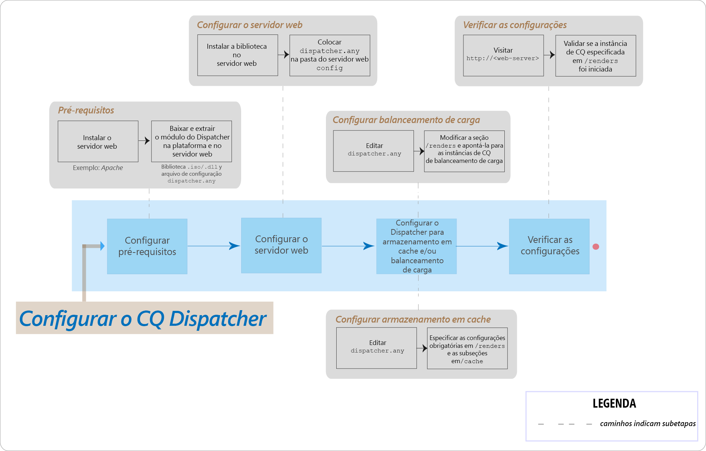

# Perguntas frequentes sobre os principais problemas do AEM Dispatcher



## Introdução

### O que é o Dispatcher?

O Dispatcher é uma ferramenta de balanceamento de carga e/ou armazenamento em cache do Adobe Experience Manager que ajuda a realizar um ambiente de criação Web rápido e dinâmico. Para armazenamento em cache, o Dispatcher funciona como parte de um servidor HTTP, como o Apache. Ela tem o objetivo de armazenar (ou &quot;armazenar em cache&quot;) o máximo possível do conteúdo estático do site e acessar o mecanismo de layout do site com a menor frequência possível. Em uma função de balanceamento de carga, o Dispatcher distribui solicitações de usuário (carga) em diferentes instâncias de AEM (renderizações).

Para armazenamento em cache, o módulo Dispatcher usa a capacidade do servidor Web de fornecer conteúdo estático. O Dispatcher coloca os documentos em cache na raiz do documento do servidor web.

### Como o Dispatcher executa o armazenamento em cache?

O Dispatcher usa a capacidade do servidor Web de fornecer conteúdo estático. O Dispatcher armazena documentos em cache na raiz de documento do servidor da Web. O Dispatcher tem dois métodos primários para atualizar o conteúdo de cache quando mudanças forem feitas ao website.

* **Atualizações de conteúdo** remova as páginas que foram alteradas e os arquivos que estão diretamente associados a elas.
* **A invalidação automática** invalida automaticamente as partes do cache que podem estar desatualizadas após uma atualização. Por exemplo, ela marca de forma eficaz as páginas relevantes como desatualizadas, sem excluir nada.

### Quais são os benefícios do balanceamento de carga?

O balanceamento de carga distribui solicitações de usuário (carga) em várias instâncias de AEM. A lista a seguir descreve as vantagens do balanceamento de carga:

* **Maior poder de processamento**: Na prática, esse método significa que o Dispatcher compartilha solicitações de documento entre várias instâncias de AEM. Como cada instância tem menos documentos para processar, você tem tempos de resposta mais rápidos. O Dispatcher mantém estatísticas internas para cada categoria de documento, de modo que ele possa estimar o carregamento e distribuir as consultas com eficiência.
* **Maior cobertura à prova de falhas**: Se o Dispatcher não receber respostas de uma instância, ele retornará automaticamente solicitações para uma das outras instâncias. Assim, se uma instância se tornar indisponível, o único efeito é uma desaceleração do site, proporcional à potência computacional perdida.

>[!NOTE]
>
>Para obter mais detalhes, consulte a [página de Visão geral do Dispatcher](dispatcher.md)

## Instalação e configuração

### De onde baixar o módulo Dispatcher?

Você pode baixar o módulo Dispatcher mais recente na página [Notas de versão do Dispatcher](release-notes.md).

### Como instalar o módulo Dispatcher?

Consulte a página [Instalação do Dispatcher](dispatcher-install.md).

### Como configurar o módulo Dispatcher?

Consulte a página [Configuração do Dispatcher](dispatcher-configuration.md).

### Como configurar o Dispatcher para a instância do autor?

Consulte [Uso do Dispatcher com uma instância de autor](dispatcher.md#using-a-dispatcher-with-an-author-server) para obter as etapas detalhadas.

### Como configurar o Dispatcher com vários domínios?

Você pode configurar o Dispatcher CQ com vários domínios, desde que os domínios satisfaçam às seguintes condições:

* O conteúdo da Web de ambos os domínios deve ser armazenado em um único repositório do AEM
* Os arquivos no cache do Dispatcher podem ser invalidados separadamente para cada domínio

Leia [Uso do Dispatcher com vários domínios](dispatcher-domains.md) para obter mais detalhes.

### Como configurar o Dispatcher, de modo que todas as solicitações de um usuário sejam roteadas para a mesma instância de publicação?

Você pode usar o recurso [conexões aderentes](dispatcher-configuration.md#identifying-a-sticky-connection-folder-stickyconnectionsfor), que garante que todos os documentos de um usuário sejam processados na mesma instância do AEM. Esse recurso é importante se você usar páginas personalizadas e dados de sessão. Os dados são armazenados na instância. Portanto, as solicitações subsequentes do mesmo usuário devem retornar a essa instância ou os dados serão perdidos.

Como as conexões aderentes restringem a capacidade do Dispatcher de otimizar as solicitações, você deve usar essa abordagem somente quando necessário. Você pode especificar a pasta que contém os documentos &quot;fixos&quot;, garantindo que todos os documentos dessa pasta sejam processados na mesma instância para um usuário.

### Posso usar conexões aderentes e armazenamento em cache em conjunto?

Para a maioria das páginas que usam conexões aderentes, você deve desativar o armazenamento em cache. Caso contrário, a mesma instância da página será exibida para todos os usuários, independentemente do conteúdo da sessão.

Para alguns aplicativos, pode ser possível usar conexões aderentes e armazenamento em cache. Por exemplo, se você exibir um formulário que grava dados em uma sessão, será possível usar conexões aderentes e armazenamento em cache em conjunto.

### Um Dispatcher e uma instância de publicação do AEM podem residir no mesmo computador?

Sim, se o computador for suficientemente eficiente. No entanto, é recomendável configurar o Dispatcher e a instância de publicação do AEM em computadores diferentes.

Normalmente, a instância de publicação reside dentro do firewall, e o Dispatcher reside no DMZ. Se decidir manter a instância de publicação e o Dispatcher no mesmo computador, verifique se as configurações de firewall proíbem o acesso direto à instância de publicação por meio de redes externas.

### Posso armazenar em cache somente arquivos com extensões específicas?

Sim. Por exemplo, se você quiser armazenar em cache somente arquivos GIF, especifique *.gif, na seção de cache do arquivo de configuração dispatcher.any.

### Como excluir arquivos do cache?

Você pode excluir arquivos do cache usando uma solicitação HTTP. Quando a solicitação HTTP é recebida, o Dispatcher exclui os arquivos do cache. O Dispatcher armazena os arquivos em cache novamente somente quando recebe uma solicitação do cliente para a página. A exclusão de arquivos em cache dessa maneira é adequada para sites que provavelmente não receberão solicitações simultâneas para a mesma página.

A solicitação HTTP tem a seguinte sintaxe:

```
POST /dispatcher/invalidate.cache HTTP/1.1
CQ-Action: Activate
CQ-Handle: path-pattern
Content-Length: 0
```

O Dispatcher exclui os arquivos e pastas em cache que têm nomes que correspondem ao valor do cabeçalho CQ-Handle. Por exemplo, um CQ-Handle de `/content/geomtrixx-outdoors/en` corresponde aos seguintes itens:

Todos os arquivos (de qualquer extensão de arquivo) nomeados em en no diretório geometrixx-outdoors. Qualquer diretório nomeado `_jcr_content` abaixo do diretório en (que, se existir, contém renderizações em cache de subnós da página).
O diretório `en` só será excluído se a variável `CQ-Action` é `Delete` ou `Deactivate`.

Para obter mais detalhes sobre este tópico, consulte [Invalidação manual do cache do Dispatcher](page-invalidate.md).

### Como implementar o armazenamento em cache sensível a permissões?

Consulte a página [Armazenamento em cache de conteúdo seguro](permissions-cache.md).

### Como proteger as comunicações entre as instâncias do Dispatcher e do CQ?

Consulte as páginas [Lista de verificação de segurança do Dispatcher](security-checklist.md) e [Lista de verificação de segurança do AEM](https://experienceleague.adobe.com/docs/experience-manager-64/administering/security/security-checklist.html?lang=en).

### Problema do Dispatcher `jcr:content` alterado para `jcr%3acontent`

**Pergunta**: Recentemente, a empresa enfrentou um problema no nível do Dispatcher. Uma das chamadas AJAX que estava recebendo alguns dados do repositório CQ tinha `jcr:content` nela. Isso foi codificado para `jcr%3acontent` resultando nesse conjunto de resultados incorreto.

**Resposta**: Use `ResourceResolver.map()` método para obter um URL &quot;amigável&quot; para ser usado/emitido obtém solicitações do e também para resolver o problema de armazenamento em cache com o Dispatcher. O método map() codifica a variável `:` dois pontos para sublinhados e o método resolve() os decodifica novamente no formato legível por SLING JCR. Use o método map() para gerar o URL usado na chamada de Ajax.

Leia mais: [https://sling.apache.org/documentation/the-sling-engine/mappings-for-resource-resolution.html#namespace-mangling](https://sling.apache.org/documentation/the-sling-engine/mappings-for-resource-resolution.html#namespace-mangling)

## Limpar o Dispatcher

### Como configurar agentes de limpeza do Dispatcher em uma instância de publicação?

Consulte a página [Replicação](https://experienceleague.adobe.com/docs/experience-manager-64/deploying/configuring/replication.html?lang=en#configuring-your-replication-agents).

### Como solucionar problemas de limpeza do Dispatcher?

[Veja estes artigos de solução de problemas](https://experienceleague.adobe.com/search.html?lang=en#q=troubleshooting%20dispatcher%20flushing%20issues&amp;sort=relevancy&amp;f:el_product=[Experience%20Manager]).

Se as operações de exclusão estiverem fazendo com que o Dispatcher libere, [use a solução alternativa nesta publicação de blog da comunidade, por Sensei Martin](https://mkalugin-cq.blogspot.com/2012/04/i-have-been-working-on-following.html).

### Como liberar ativos DAM do cache do Dispatcher?

Você pode usar o recurso &quot;replicação em cadeia&quot;. Com esse recurso ativado, o agente de liberação do Dispatcher envia uma solicitação de liberação quando uma replicação é recebida do autor.

Para habilitá-lo:

1. [Siga as etapas aqui](page-invalidate.md#invalidating-dispatcher-cache-from-a-publishing-instance) para criar agentes de liberação ao publicar
1. Vá para a configuração de cada agente e no **Triggers** marque a guia . **Ao receber** caixa.

## Diversos

Como o Dispatcher determina se um documento está atualizado?
Para determinar se um documento está atualizado, o Dispatcher executa estas ações:

Verifica se o documento está sujeito a invalidação automática. Caso contrário, o documento será considerado atualizado.
Se o documento estiver configurado para invalidação automática, o Dispatcher verificará se ele é mais antigo ou mais recente do que a última alteração disponível. Se for mais antigo, o Dispatcher solicitará a versão atual da instância do AEM e substituirá a versão no cache.

### Como o Dispatcher retorna documentos?

Você pode definir se o Dispatcher armazena em cache um documento usando o arquivo [Configuração do Dispatcher](dispatcher-configuration.md), `dispatcher.any`. O Dispatcher verifica a solicitação em relação à lista de documentos que podem ser armazenados em cache. Se o documento não estiver nessa lista, o Dispatcher solicitará o documento da instância do AEM.

A propriedade `/rules` controla quais documentos são armazenados em cache de acordo com o caminho do documento. Independentemente da propriedade `/rules`, o Dispatcher nunca armazena em cache um documento nas seguintes circunstâncias:

* O URI da solicitação contém um `(?)` ponto de interrogação.
* Indica uma página dinâmica, como um resultado de pesquisa que não precisa ser armazenado em cache.
* A extensão do arquivo está ausente.
* O servidor Web precisa da extensão para determinar o tipo de documento (o tipo MIME).
* O cabeçalho de autenticação está definido (configurável).
* Se a instância do AEM responder com os seguintes cabeçalhos:
   * no-cache
   * no-store
   * must-revalidate

O Dispatcher armazena os arquivos em cache no servidor Web como se fossem parte de um site estático. Se um usuário solicitar um documento armazenado em cache, o Dispatcher verificará se esse documento existe no sistema de arquivos do servidor Web. Nesse caso, o Dispatcher retornará os documentos. Se não estiver em cache, o Dispatcher solicitará o documento da instância do AEM.

>[!NOTE]
>
>Os métodos GET ou HEAD (para o cabeçalho HTTP) podem ser armazenados em cache pelo Dispatcher. Para obter informações adicionais sobre o armazenamento em cache do cabeçalho de resposta, consulte a seção [Armazenamento em cache de cabeçalhos de resposta HTTP](dispatcher-configuration.md#caching-http-response-headers).

### Posso implementar vários Dispatchers em uma configuração?

Sim. Nesses casos, verifique se os Dispatchers podem acessar o site do AEM diretamente. Um Dispatcher não pode lidar com solicitações provenientes de outro Dispatcher.
