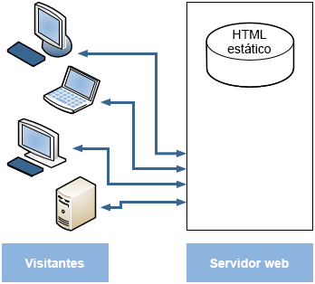
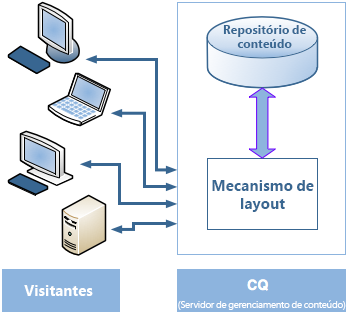
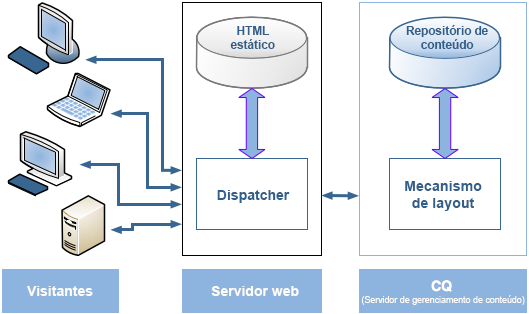
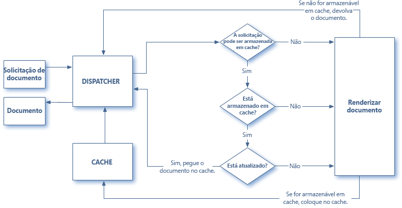
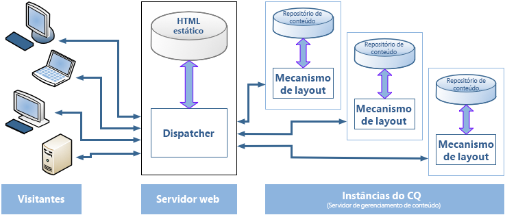

# Visão geral do Dispatcher {#dispatcher-overview}

>[!NOTE]
>
>As versões do Dispatcher são independentes do AEM. Você pode ter sido redirecionado para esta página se tiver seguido um link para a documentação do Dispatcher incorporada à documentação de uma versão anterior do AEM.

O Dispatcher é a ferramenta de balanceamento de carga e caching da Adobe Experience Manager, usada com um servidor Web de classe empresarial.

O processo de implantação do Dispatcher é independente do servidor da Web e da plataforma de SO escolhida:

1. Saiba mais sobre o Dispatcher (nesta página). Além disso, consulte [perguntas frequentes sobre o Dispatcher](/help/using/dispatcher-faq.md).
1. Instale um [servidor Web compatível](https://experienceleague.adobe.com/docs/experience-manager-65/deploying/introduction/technical-requirements.html?lang=pt-BR) de acordo com a documentação do servidor Web.
1. [Instale o módulo Dispatcher](dispatcher-install.md) em seu servidor Web e configure o servidor Web apropriadamente.
1. [Configurar o Dispatcher](dispatcher-configuration.md) (qualquer arquivo no dispatcher).
1. [Configure o AEM](page-invalidate.md) para que atualizações de conteúdo invalidem o cache.

>[!NOTE]
>
>Para entender melhor como o Dispatcher funciona com o AEM:
>
>* Consulte [Pergunte aos especialistas da comunidade AEM, de julho de 2017](https://communities.adobeconnect.com/pf0gem7igw1f/).
>* Acesse [este repositório](https://github.com/adobe/aem-dispatcher-experiments). Ele contém uma coleção de experiências num formato de laboratório &quot;móvel&quot;.


Use as seguintes informações conforme necessário:

* [Lista de verificação de segurança do Dispatcher](security-checklist.md)
* [Base de conhecimento do Dispatcher](https://helpx.adobe.com/experience-manager/kb/index/dispatcher.html)
* [Otimização de um site para desempenho de cache](https://experienceleague.adobe.com/docs/experience-manager-65/deploying/configuring/configuring-performance.html)
* [Utilização do Dispatcher com vários domínios](dispatcher-domains.md)
* [Utilização do SSL com o Dispatcher](dispatcher-ssl.md)
* [Implementação de armazenamento em cache sensível a permissões](permissions-cache.md)
* [Resolução de problemas do Dispatcher](dispatcher-troubleshooting.md)
* [Perguntas frequentes sobre os principais problemas do Dispatcher](dispatcher-faq.md)

>[!NOTE]
>
>**O uso mais comum do Dispatcher** é armazenar em cache as respostas de uma **instância de publicação** do AEM, para aumentar a capacidade de resposta e a segurança de seu site publicado voltado para o exterior. A maior parte da discussão se concentra nesse caso.
>
>Mas o Dispatcher também pode ser usado para aumentar a capacidade de resposta da instância do seu **autor**, principalmente se você tiver um grande número de usuários editando e atualizando seu site. Para obter detalhes específicos deste caso, consulte [Uso de um Dispatcher com um servidor de autor](#using-a-dispatcher-with-an-author-server), abaixo.

## Por que usar o Dispatcher para implementar o armazenamento em cache? {#why-use-dispatcher-to-implement-caching}

Há duas abordagens básicas para publicação na Web:

* **Servidores Web estáticos**: como Apache ou IIS, são simples, mas rápidos.
* **Servidores**: que fornecem conteúdo dinâmico, em tempo real e inteligente, mas exigem muito mais tempo de computação e outros recursos.

O Dispatcher ajuda a realizar um ambiente rápido e dinâmico. Funciona como parte de um servidor HTML estático, como o Apache, com o objetivo de:

* armazenar (ou &quot;armazenar em cache&quot;) o máximo possível do conteúdo do site, na forma de um site estático
* acesso ao mecanismo de layout o mínimo possível.

O que significa que:

* **conteúdo estático** O é manipulado com a mesma velocidade e facilidade de um servidor Web estático. Além disso, você pode usar as ferramentas de administração e segurança disponíveis para seus servidores Web estáticos.

* o **conteúdo dinâmico** é gerado conforme necessário, sem retardar o sistema além do absolutamente necessário.

O Dispatcher contém mecanismos para gerar e atualizar HTML estático com base no conteúdo do site dinâmico. Você pode especificar em detalhes quais documentos são armazenados como arquivos estáticos e quais são sempre gerados dinamicamente.

A presente seção ilustra os princípios subjacentes a este processo.

### Servidor Web estático {#static-web-server}



Um servidor Web estático, como o Apache ou o IIS, serve arquivos HTML estáticos para os visitantes do seu site. As páginas estáticas são criadas uma vez, portanto, o mesmo conteúdo é entregue para cada solicitação.

Esse processo é simples e eficiente. Se um visitante solicitar um arquivo como uma página de HTML, o arquivo será retirado diretamente da memória; na pior das hipóteses, ele é lido da unidade local. Os servidores Web estáticos estão disponíveis há bastante tempo, portanto há uma grande variedade de ferramentas para administração e gerenciamento de segurança, e eles estão bem integrados às infraestruturas de rede.

### Servidores de gerenciamento de conteúdo {#content-management-servers}



Se você usar um CMS (Content Management Server), como AEM, um mecanismo de layout avançado processa a solicitação de um visitante. O mecanismo lê o conteúdo de um repositório que, combinado com estilos, formatos e direitos de acesso, transforma o conteúdo em um documento adaptado às necessidades e direitos de um visitante.

Esse fluxo de trabalho permite que você crie conteúdo dinâmico e mais rico, o que aumenta a flexibilidade e funcionalidade do seu site. No entanto, o mecanismo de layout requer mais potência do que um servidor estático, portanto, essa configuração pode ser sujeita a lentidão se muitos visitantes usarem o sistema.

## Como o Dispatcher executa o armazenamento em cache {#how-dispatcher-performs-caching}



**O diretório** de cache para armazenamento em cache, o módulo Dispatcher, usa a capacidade do servidor Web de fornecer conteúdo estático. O Dispatcher coloca os documentos em cache na raiz do documento do servidor web.

>[!NOTE]
>
>Quando falta a configuração para o HTTP Header Caching, o Dispatcher armazena apenas o código HTML da página - não armazena os cabeçalhos HTTP. Esse cenário pode ser um problema se você usar codificações diferentes em seu site, pois essas páginas podem se perder. Para permitir o HTTP Header Caching, veja [Configuração do Cache do Dispatcher.](https://experienceleague.adobe.com/docs/experience-manager-dispatcher/using/configuring/dispatcher-configuration.html?lang=pt-BR)

>[!NOTE]
>
>Localizar o documento-raiz do seu servidor Web no armazenamento anexo à rede (NAS) causa degradação de desempenho. Além disso, quando um documento raiz no NAS é compartilhado entre vários servidores da Web, bloqueios intermitentes podem ocorrer quando ações de replicação são executadas.

>[!NOTE]
>
>O Dispatcher armazena o documento em cache em uma estrutura igual ao URL solicitado.
>
>Pode haver limitações no nível do sistema operacional para o comprimento do nome do arquivo. Ou seja, se você tiver um URL com vários seletores.

### Métodos de cache

O Dispatcher tem dois métodos primários para atualizar o conteúdo de cache quando mudanças forem feitas ao website.

* **Atualizações de conteúdo** remova as páginas que foram alteradas e os arquivos que estão diretamente associados a elas.
* **A invalidação automática** invalida automaticamente as partes do cache que podem estar desatualizadas após uma atualização. Ou seja, efetivamente sinaliza páginas relevantes como estando desatualizadas, sem excluir nada.

### Atualizações de conteúdo

Em uma atualização de conteúdo, um ou mais documentos do AEM são alterados. O AEM envia uma solicitação de agregação para o Dispatcher, que atualiza o cache de acordo:

1. Ele exclui os arquivos modificados do cache.
1. Ele exclui do cache todos os arquivos que iniciam com o mesmo identificador. Por exemplo, se o arquivo /en/index.html for atualizado, todos os arquivos que começam com /en/index. são excluídos. Esse mecanismo permite que você crie sites eficientes em cache, especialmente sobre navegação de imagens.
1. It *toques* o chamado **statfile**, que atualiza o carimbo de data e hora do arquivo de status para indicar a data da última alteração.

É de salientar os seguintes pontos:

* As Atualizações de conteúdo geralmente são usadas com um sistema de criação que &quot;sabe&quot; o que deve ser substituído.
* Os arquivos afetados por uma atualização de conteúdo são removidos, mas não são substituídos imediatamente. Na próxima vez que um arquivo for solicitado, o Dispatcher buscará o novo arquivo da instância de AEM e o colocará no cache, substituindo o conteúdo antigo.
* Normalmente, as imagens geradas automaticamente que incorporam texto de uma página são armazenadas em arquivos de imagem que começam com o mesmo identificador - garantindo assim que a associação exista para exclusão. Por exemplo, você pode armazenar o texto do título da página mypage.html como a imagem mypage.titlePicture.gif na mesma pasta. Desta forma, a imagem é automaticamente eliminada do cache sempre que a página é atualizada, para que possa ter a certeza de que a imagem reflete sempre a versão atual da página.
* Você pode ter vários arquivos de status, por exemplo, um por pasta de idioma. Se uma página for atualizada, o AEM procurará a próxima pasta pai que contém um arquivo de status e *tocará* esse arquivo.

### Invalidação automática

A invalidação automática invalida automaticamente partes do cache - sem excluir fisicamente quaisquer arquivos. Em cada atualização de conteúdo, o chamado arquivo de status é tocado, portanto, seu carimbo de data e hora reflete a última atualização de conteúdo.

O Dispatcher tem uma lista de arquivos que estão sujeitos à invalidação automática. Quando um documento dessa lista é solicitado, o Dispatcher compara a data do documento em cache com o carimbo de data e hora do arquivo de status:

* se o documento em cache for mais recente, o Dispatcher o retornará.
* se for mais antigo, o Dispatcher recuperará a versão atual da instância do AEM.

Mais uma vez, é de salientar alguns pontos:

* Normalmente, a invalidação automática é usada quando as inter-relações são complexas, como HTML pages. Essas páginas contêm links e entradas de navegação, portanto, elas geralmente precisam ser atualizadas após uma atualização de conteúdo. Caso tenha gerado automaticamente arquivos de PDF ou imagem, você pode optar por invalidar automaticamente esses arquivos também.
* A invalidação automática não envolve nenhuma ação do Dispatcher no momento da atualização, exceto para tocar no arquivo de status. Entretanto, tocar no arquivo de status torna automaticamente o conteúdo do cache obsoleto, sem removê-lo fisicamente do cache.

## Como o Dispatcher retorna documentos {#how-dispatcher-returns-documents}



### Determinar se um documento está sujeito ao armazenamento em cache

Você pode [definir quais documentos o Dispatcher armazena em cache no arquivo de configuração](https://experienceleague.adobe.com/docs/experience-manager-dispatcher/using/configuring/dispatcher-configuration.html?lang=pt-BR). O Dispatcher verifica a solicitação em relação à lista de documentos que podem ser armazenados em cache. Se o documento não estiver nessa lista, o Dispatcher solicitará o documento da instância do AEM.

O Dispatcher sempre solicita o documento diretamente da instância do AEM nos seguintes casos:

* O URI da solicitação contém um ponto de interrogação &quot;`?`&quot;. Esse cenário geralmente indica uma página dinâmica, como um resultado de pesquisa, que não precisa ser armazenada em cache.
* A extensão do arquivo está ausente. O servidor Web precisa da extensão para determinar o tipo de documento (o tipo MIME).
* O cabeçalho de autenticação está definido (configurável).

>[!NOTE]
>
>Os métodos GET ou HEAD (para o cabeçalho HTTP) podem ser armazenados em cache pelo Dispatcher. Para obter informações adicionais sobre o armazenamento em cache do cabeçalho de resposta, consulte a seção [Armazenamento em cache de cabeçalhos de resposta HTTP](https://experienceleague.adobe.com/docs/experience-manager-dispatcher/using/configuring/dispatcher-configuration.html?lang=pt-BR).

### Determinar se um documento está em cache

O Dispatcher armazena os arquivos em cache no servidor Web como se fossem parte de um site estático. Se um usuário solicitar um documento armazenável em cache, o Dispatcher verificará se esse documento existe no sistema de arquivos do servidor Web:

* se o documento estiver em cache, o Dispatcher retornará o arquivo.
* se não estiver em cache, o Dispatcher solicitará o documento da instância do AEM.

### Como determinar se um documento está atualizado

Para descobrir se um documento está atualizado, o Dispatcher executa duas etapas:

1. Verifica se o documento está sujeito a invalidação automática. Caso contrário, o documento será considerado atualizado.
1. Se o documento estiver configurado para invalidação automática, o Dispatcher verificará se ele é mais antigo ou mais recente do que a última alteração disponível. Se for mais antigo, o Dispatcher solicitará a versão atual da instância do AEM e substituirá a versão no cache.

>[!NOTE]
>
>Documentos sem documentos **invalidação automática** permaneçam no cache até serem fisicamente excluídas. Por exemplo, por uma atualização de conteúdo no site.

## Os benefícios do balanceamento de carga {#the-benefits-of-load-balancing}

Balanceamento de carga é a prática de distribuir a carga computacional do site em várias instâncias do AEM.



Você ganha:

* **maior potência de processamento**
Na prática, um maior poder de processamento significa que o Dispatcher compartilha solicitações de documento entre várias instâncias de AEM. Como cada instância agora tem menos documentos para processar, você tem tempos de resposta mais rápidos. O Dispatcher mantém estatísticas internas para cada categoria de documento, de modo que ele possa estimar o carregamento e distribuir as consultas com eficiência.

* **maior cobertura à prova de falhas**
Se o Dispatcher não receber respostas de uma instância, ele retornará automaticamente solicitações para uma das outras instâncias. Se uma instância se tornar indisponível, o único efeito é um abrandamento do site, proporcional à potência computacional perdida. No entanto, todos os serviços continuam.

* Você também pode gerenciar sites diferentes no mesmo servidor Web estático.

>[!NOTE]
>
>Enquanto o balanceamento de carga espalha a carga com eficiência, o cache ajuda a reduzir a carga. Portanto, tente otimizar o cache e reduzir a carga geral antes de configurar o balanceamento de carga. Um bom cache pode aumentar o desempenho do balanceador de carga ou tornar desnecessário o balanceamento de carga.

>[!CAUTION]
>
>Embora um único Dispatcher seja capaz de saturar a capacidade das instâncias de Publicação disponíveis, para alguns aplicativos raros, pode fazer sentido também equilibrar a carga entre duas instâncias do Dispatcher. As configurações com vários Dispatchers devem ser consideradas cuidadosamente, pois um Dispatcher extra pode aumentar a carga nas instâncias de Publicação disponíveis e pode facilmente diminuir o desempenho na maioria dos aplicativos.

## Como o Dispatcher executa o balanceamento de carga {#how-the-dispatcher-performs-load-balancing}

### Estatísticas de desempenho

O Dispatcher mantém estatísticas internas sobre a velocidade com que cada instância do AEM processa documentos. Com base nesses dados, o Dispatcher estima qual instância pode fornecer o tempo de resposta mais rápido ao responder uma solicitação e, portanto, reserva o tempo de cálculo necessário para essa instância.

Tipos diferentes de solicitações podem ter tempos médios diferentes de conclusão, de modo que o Dispatcher permite que você especifique categorias de documento. Essas categorias são então consideradas ao calcular as estimativas de tempo. Por exemplo, você pode distinguir entre HTML pages e imagens, já que os tempos de resposta típicos podem ser diferentes.

Se você usar uma função de pesquisa elaborada, poderá criar uma categoria para consultas de pesquisa. Esse método ajuda o Dispatcher a enviar consultas de pesquisa para a instância que responde mais rapidamente. Também ajuda a impedir que uma instância mais lenta seja paralisada quando recebe várias consultas de pesquisa &quot;caras&quot;, enquanto as outras recebem as solicitações &quot;mais baratas&quot;.

### Conteúdo personalizado (conexões adesivas)

As conexões adesivas garantem que os documentos de um usuário sejam todos compostos na mesma instância do AEM. Esse ponto é importante se você usar páginas personalizadas e dados de sessão. Os dados são armazenados na instância, portanto as solicitações subsequentes do mesmo usuário devem retornar a essa instância ou os dados são perdidos.

Como as conexões aderentes restringem a capacidade do Dispatcher de otimizar as solicitações, você deve usá-las somente quando necessário. Você pode especificar a pasta que contém os documentos &quot;fixos&quot;, garantindo que todos os documentos dessa pasta sejam compostos na mesma instância para cada usuário.

>[!NOTE]
>
>Para a maioria das páginas que usam conexões adesivas, é necessário desligar o cache; caso contrário, a página será a mesma para todos os usuários, independentemente do conteúdo da sessão.
>
>Para *algumas* aplicações, pode ser possível utilizar ligações aderentes e armazenamento em cache; por exemplo, se você exibir um formulário que grava dados na sessão.

## Uso de vários Dispatchers {#using-multiple-dispatchers}

Em configurações complexas, você pode usar vários Dispatchers. Por exemplo, você pode usar:

* um Dispatcher para publicar um site na Intranet
* um segundo Dispatcher, em um endereço diferente e com configurações de segurança diferentes, para publicar o mesmo conteúdo na Internet.

Nesse caso, verifique se cada solicitação passa por apenas um Dispatcher. Um Dispatcher não lida com solicitações provenientes de outro Dispatcher. Portanto, verifique se ambos os Dispatchers acessam o site do AEM diretamente.

## Uso do Dispatcher com um CDN {#using-dispatcher-with-a-cdn}

Uma rede de entrega de conteúdo (CDN), como Akamai Edge Delivery ou Amazon Cloud Front, fornece conteúdo de um local próximo ao usuário final. Assim,

* acelera os tempos de resposta para usuários finais
* e carrega seus servidores

Como um componente de infraestrutura HTTP, um CDN funciona como o Dispatcher. Quando um nó CDN recebe uma solicitação, ele serve a solicitação de seu cache, se possível (o recurso está disponível no cache e é válido). Caso contrário, ele chegará ao próximo servidor mais próximo para recuperar o recurso e armazená-lo em cache para outras solicitações, se apropriado.

O &quot;próximo servidor mais próximo&quot; depende de sua configuração específica. Por exemplo, em uma configuração do Akamai, a solicitação pode seguir o seguinte caminho:

* O nó Akamai Edge
* A Camada Akamai Midgres
* Seu firewall
* Seu balanceador de carga
* Dispatcher
* AEM

Normalmente, o Dispatcher é o próximo servidor que pode servir o documento de um cache e influenciar os cabeçalhos de resposta retornados ao servidor CDN.

## Controle de um cache CDN {#controlling-a-cdn-cache}

Há várias maneiras de controlar por quanto tempo um CDN armazena em cache um recurso antes de buscá-lo novamente no Dispatcher.

1. Configuração explícita\
   Configure por quanto tempo os recursos específicos são mantidos no cache do CDN, dependendo do tipo MIME, extensão, tipo de solicitação e assim por diante.

1. Cabeçalhos de expiração e controle de cache\
   Honra da maioria das CDNs `Expires:` e `Cache-Control:` Cabeçalhos HTTP, se enviados pelo servidor upstream. Esse método pode ser obtido, por exemplo, usando a variável [mod_expires](https://httpd.apache.org/docs/2.4/mod/mod_expires.html) Módulo Apache

1. Invalidação manual\
   As CDNs permitem que os recursos sejam removidos do cache por meio de interfaces da Web.
1. Invalidação baseada em API\
   A maioria das CDNs também oferece uma REST e/ou SOAP API que permite a remoção de recursos do cache.

Em uma configuração de AEM típica, a configuração por extensão, por caminho ou por ambos - que pode ser alcançada através dos pontos 1 e 2 acima - oferece possibilidades de definir períodos razoáveis de cache para recursos frequentemente usados que não são alterados com frequência, como imagens de design e bibliotecas de clientes. Quando novas versões são implantadas, geralmente é necessária uma invalidação manual.

Se essa abordagem for usada para armazenar em cache conteúdo gerenciado, isso implica que as alterações de conteúdo só estarão visíveis para os usuários finais depois que o período de cache configurado expirar e o documento for buscado do Dispatcher novamente.

Para obter um controle mais refinado, a invalidação baseada em API permite invalidar o cache de um CDN, pois o cache do Dispatcher é invalidado. Com base na API de CDNs, você pode implementar o seu próprio [ContentBuilder](https://developer.adobe.com/experience-manager/reference-materials/6-5/javadoc/com/day/cq/replication/ContentBuilder.html) e [TransportHandler](https://developer.adobe.com/experience-manager/reference-materials/6-5/javadoc/com/day/cq/replication/TransportHandler.html) (se a API não for baseada em REST) e configure um Agente de Replicação que use esses pedaços para invalidar o cache do CDN.

>[!NOTE]
>
>Consulte também [Segurança do AEM (CQ) Dispatcher e Armazenamento em cache de CDN+Browser](https://www.slideshare.net/andrewmkhoury/dispatcher-caching-aemgemspart2jan2015) e uma apresentação gravada sobre [Armazenamento em cache do Dispatcher](https://experienceleague.adobe.com/docs/experience-manager-gems-events/gems/gems2015/aem-dispatcher-caching-new-features-and-optimizations.html?lang=en).

## Uso de um Dispatcher com um Servidor de Autores {#using-a-dispatcher-with-an-author-server}

>[!CAUTION]
>
>Se você usar [AEM com interface de toque](https://experienceleague.adobe.com/docs/experience-manager-65/developing/introduction/touch-ui-concepts.html?lang=en), do **not** conteúdo da instância do autor de cache. Se o cache tiver sido ativado para a instância do autor, você deverá desativá-lo e excluir o conteúdo do diretório do cache. Para desativar o armazenamento em cache, edite a variável `author_dispatcher.any` e modifique o `/rule` da `/cache` seção como segue:

```xml
/rules
{
/0000
{ /type "deny" /glob "*"}
}
```

Um Dispatcher pode ser usado na frente de uma instância do autor para melhorar o desempenho da criação. Para configurar um Dispatcher de criação, faça o seguinte:

1. Instale um Dispatcher em um servidor da Web (um servidor da Web Apache ou IIS), consulte [Instalação do Dispatcher](dispatcher-install.md)).
1. Teste o Dispatcher recém-instalado em relação a uma instância de publicação de AEM em funcionamento. Isso garante que uma instalação correta da linha de base foi atingida.
1. Agora, verifique se o Dispatcher consegue se conectar via TCP/IP à sua instância do autor.
1. Substitua a amostra `dispatcher.any` com o `author_dispatcher.any` arquivo fornecido com o [Download do Dispatcher](release-notes.md#downloads).
1. Abra o `author_dispatcher.any` em um editor de texto e faça as seguintes alterações:

   1. Altere o `/hostname` e `/port` do `/renders` para que apontem para a instância do autor.
   1. Altere o `/docroot` do `/cache` para que apontem para um diretório de cache. Caso esteja usando o [AEM com Touch UI](https://experienceleague.adobe.com/docs/experience-manager-65/developing/introduction/touch-ui-concepts.html?lang=en), consulte o aviso acima.
   1. Salve as alterações.

1. Exclua todos os arquivos existentes no diretório `/cache` > `/docroot` que você configurou acima.
1. Reinicie o servidor Web.

>[!NOTE]
>
>Com o `author_dispatcher.any` configuração, ao instalar um pacote de recursos, hotfix ou pacote de código de aplicativo do CQ5 que afeta qualquer conteúdo sob `/libs` ou `/apps`, você deve excluir os arquivos em cache nesses diretórios no cache do Dispatcher. Isso garante que, na próxima vez que forem solicitados, os arquivos recém-atualizados sejam buscados, e não os arquivos em cache antigos.

>[!CAUTION]
>
>Se você tiver usado o Dispatcher do autor previamente configurado e ativado um *Agente de descarga do Dispatcher*, faça o seguinte:

1. Exclua ou desative o **do Dispatcher do autor** agente de descarga na instância do autor AEM.
1. Refaça a configuração do Dispatcher do autor seguindo as novas instruções acima.

<!--
[Author Dispatcher configuration file (Dispatcher 4.1.2 or later)](assets/author_dispatchernew.any)
-->
<!--[!NOTE]
>
>A related knowledge base article can be found here:  
>[How to configure the dispatcher in front of an authoring environment](https://helpx.adobe.com/cq/kb/HowToConfigureDispatcherForAuthoringEnvironment.html)
-->
