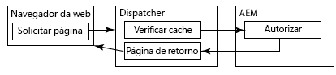
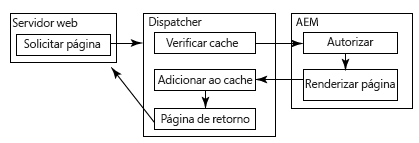
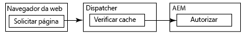

# Armazenamento em cache de conteúdo protegido {#caching-secured-content}

O armazenamento em cache sensível a permissões possibilita armazenar páginas seguras em cache. O Dispatcher verifica as permissões de acesso do usuário para uma página antes de entregar a página em cache.

O Dispatcher inclui o módulo AuthChecker, que implementa o armazenamento sensível a permissões. Quando o módulo é ativado, o renderizador chama um servlet AEM para executar a autenticação e autorização do usuário para o conteúdo solicitado. A resposta do servlet determina se o conteúdo será entregue ao navegador da Web.

Como os métodos de autenticação e autorização são específicos para a implantação do AEM, é necessário criar o servlet.

>[!NOTE]
>
>Use filtros de `deny` para aplicar restrições gerais de segurança. Use o armazenamento em cache sensível a permissões para páginas configuradas para acessar um subconjunto de usuários ou grupos.

Os diagramas a seguir ilustram a ordem dos eventos que ocorrem quando um navegador da Web solicita uma página para a qual o armazenamento em cache sensível a permissões é usado.

## A página é armazenada em cache e o usuário é autorizado {#page-is-cached-and-user-is-authorized}



1. O Dispatcher determina que o conteúdo solicitado esteja armazenado em cache e seja válido.
1. O Dispatcher envia uma mensagem de solicitação ao renderizador. A seção HEAD inclui todas as linhas de cabeçalho da solicitação do navegador.
1. O renderizador chama o autorizador para executar a verificação de segurança e responde ao Dispatcher. A mensagem de resposta inclui um código de status HTTP 200 para indicar que o usuário está autorizado.
1. O Dispatcher envia uma mensagem de resposta para o navegador que consiste nas linhas de cabeçalho da resposta de renderização e do conteúdo em cache no corpo.

## A página não é armazenada em cache e o usuário é autorizado {#page-is-not-cached-and-user-is-authorized}



1. O Dispatcher determina que o conteúdo não seja armazenado em cache ou exige atualização.
1. O Dispatcher encaminha a solicitação original para o renderizador.
1. O renderizador chama o servlet do autorizador para executar uma verificação de segurança. Quando o usuário é autorizado, o renderizador inclui a página renderizada no corpo da mensagem de resposta.
1. O Dispatcher encaminha a resposta ao navegador. O Dispatcher adiciona o corpo da mensagem de resposta do renderizador ao cache.

## O usuário não está autorizado {#user-is-not-authorized}



1. O Dispatcher verifica o cache.
1. O Dispatcher envia uma mensagem de solicitação para o renderizador, que inclui todas as linhas de cabeçalho da solicitação do navegador.
1. O renderizador chama o servlet do autorizador para executar uma verificação de segurança que falha, e o renderizador encaminha a solicitação original para o Dispatcher.

## Implementação de armazenamento em cache sensível a permissões {#implementing-permission-sensitive-caching}

Para implementar o armazenamento em cache sensível a permissões, execute as seguintes tarefas:

* Desenvolva um servlet que execute autenticação e autorização
* Configure o Dispatcher

>[!NOTE]
>
>Normalmente, os recursos seguros são armazenados em uma pasta separada dos arquivos não seguros. Por exemplo, /content/secure/


## Criação de servlet de autorização {#create-the-authorization-servlet}

Crie e implante um servlet que execute a autenticação e a autorização do usuário que solicita o conteúdo da Web. O servlet pode usar qualquer método de autenticação e autorização, como a conta de usuário do AEM e ACLs do repositório ou um serviço de pesquisa LDAP. Você implanta o servlet na instância de AEM que o Dispatcher usa como renderizador.

O servlet deve ser acessível a todos os usuários. Portanto, seu servlet deve estender a classe `org.apache.sling.api.servlets.SlingSafeMethodsServlet`, que fornece acesso somente de leitura ao sistema.

O servlet recebe apenas solicitações HEAD do renderizador, portanto, você só precisa implementar o método `doHead`.

O renderizador inclui o URI do recurso solicitado como parâmetro da solicitação HTTP. Por exemplo, um servlet de autorização é acessado via `/bin/permissioncheck`. Para executar uma verificação de segurança na página /content/geometrixx-outdoors/en.html, o renderizador inclui o seguinte URL na solicitação HTTP:

`/bin/permissioncheck?uri=/content/geometrixx-outdoors/en.html`

A mensagem de resposta do servlet deve conter os seguintes códigos de status HTTP:

* 200: Autenticação e autorização transmitidas.

O servlet de exemplo a seguir obtém o URL do recurso da solicitação HTTP. O código usa a anotação Felix SCR `Property` para definir o valor da propriedade `sling.servlet.paths` como /bin/permissioncheck. No método `doHead`, o servlet obtém o objeto da sessão e usa o método `checkPermission` para determinar o código de resposta apropriado.

>[!NOTE]
>
>O valor da propriedade sling.servlet.paths deve ser ativado no serviço Sling Servlet Resolver (org.apache.sling.servlets.resolver.SlingServletResolver).

### Exemplo de servlet {#example-servlet}

```java
package com.adobe.example;

import org.apache.felix.scr.annotations.Component;
import org.apache.felix.scr.annotations.Service;
import org.apache.felix.scr.annotations.Property;

import org.apache.sling.api.SlingHttpServletRequest;
import org.apache.sling.api.SlingHttpServletResponse;
import org.apache.sling.api.servlets.SlingSafeMethodsServlet;

import org.slf4j.Logger;
import org.slf4j.LoggerFactory;

import javax.jcr.Session;

@Component(metatype=false)
@Service
public class AuthcheckerServlet extends SlingSafeMethodsServlet {
 
    @Property(value="/bin/permissioncheck")
    static final String SERVLET_PATH="sling.servlet.paths";
    
    private Logger logger = LoggerFactory.getLogger(this.getClass());
    
    public void doHead(SlingHttpServletRequest request, SlingHttpServletResponse response) {
     try{ 
      //retrieve the requested URL
      String uri = request.getParameter("uri");
      //obtain the session from the request
      Session session = request.getResourceResolver().adaptTo(javax.jcr.Session.class);     
      //perform the permissions check
      try {
       session.checkPermission(uri, Session.ACTION_READ);
       logger.info("authchecker says OK");
       response.setStatus(SlingHttpServletResponse.SC_OK);
      } catch(Exception e) {
       logger.info("authchecker says READ access DENIED!");
       response.setStatus(SlingHttpServletResponse.SC_FORBIDDEN);
      }
     }catch(Exception e){
      logger.error("authchecker servlet exception: " + e.getMessage());
     }
    }
}
```

## Configuração do Dispatcher para armazenamento em cache sensível a permissões {#configure-dispatcher-for-permission-sensitive-caching}

A seção auth_checker do arquivo dispatcher.any controla o comportamento do armazenamento em cache sensível a permissões. A seção auth_checker inclui as seguintes subseções:

* `url`: O valor da propriedade `sling.servlet.paths` do servlet que executa a verificação de segurança.

* `filter`: Filtros que especificam as pastas às quais o armazenamento em cache sensível a permissões é aplicado. Normalmente, um filtro `deny` é aplicado a todas as pastas, e os filtros `allow` são aplicados às pastas seguras.

* `headers`: Especifica os cabeçalhos HTTP que o servlet de autorização inclui na resposta.

Quando o Dispatcher é iniciado, o arquivo de log do Dispatcher inclui a seguinte mensagem no nível de depuração:

`AuthChecker: initialized with URL 'configured_url'.`

O exemplo de seção auth_checker a seguir configura o Dispatcher para usar o servlet do tópico anterior. A seção de filtro faz com que as verificações de permissão sejam executadas somente em recursos HTML seguros.

### Exemplo de configuração {#example-configuration}

```xml
/auth_checker
  {
  # request is sent to this URL with '?uri=<page>' appended
  /url "/bin/permissioncheck"
      
  # only the requested pages matching the filter section below are checked,
  # all other pages get delivered unchecked
  /filter
    {
    /0000
      {
      /glob "*"
      /type "deny"
      }
    /0001
      {
      /glob "/content/secure/*.html"
      /type "allow"
      }
    }
  # any header line returned from the auth_checker's HEAD request matching
  # the section below will be returned as well
  /headers
    {
    /0000
      {
      /glob "*"
      /type "deny"
      }
    /0001
      {
      /glob "Set-Cookie:*"
      /type "allow"
      }
    }
  }
```
